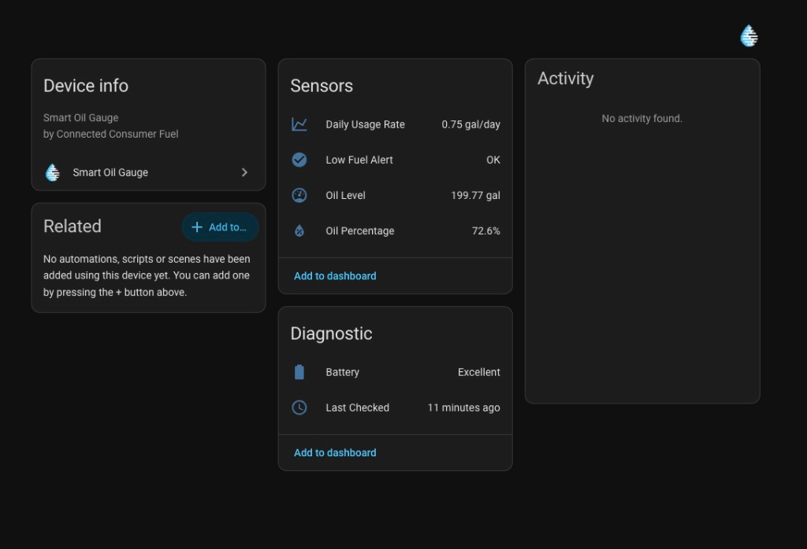

# Smart Oil Gauge integration for Home Assistant

  

A HACS-compatible Home Assistant custom integration for the **Smart Oil Gauge** by Connected Consumer Fuel. This integration logs into the Smart Oil Gauge web portal, retrieves tank metrics via AJAX, and registers each tank as a device with associated sensors.

  

## Features

- **Oil Level Sensor** (`sensor.oil_tank_level`): Remaining fuel level in gallons (preferring physical sensor readings and falling back to model estimates).
- **Oil Percentage Sensor** (`sensor.oil_tank_percentage`): Percentage of the tank capacity that is full.
- **Daily Usage Rate Sensor** (`sensor.oil_tank_daily_usage_rate`): Average rolling daily consumption rate in gallons per day (`gal/day`).
- **Estimated Runout Date Sensor** (`sensor.oil_tank_estimated_runout_date`): Estimated timestamp when fuel will reach 0 gallons based on current level and daily usage rate.
- **Refill Detection Sensors**:
  - **Last Refill Amount** (`sensor.oil_tank_last_refill_amount`): Gallons added during the most recent detected refill.
  - **Last Refill Date** (`sensor.oil_tank_last_refill_date`): Timestamp when the refill was detected.
- **Battery Sensor** (`sensor.oil_tank_battery`): Battery health diagnostic status (e.g., `Excellent`, `Good`, `Fair`, `Poor`), with dynamic battery icons.
- **Last Portal Update Sensor** (`sensor.oil_tank_last_portal_update`): Timestamp of the last successful integration refresh.
- **Max Level Sensor** (`sensor.oil_tank_max_level`): Total nominal tank capacity in gallons.
- **Max Fill Sensor** (`sensor.oil_tank_max_fill`): Remaining fillable capacity in gallons.
- **Days to 1/4 Sensor** (`sensor.oil_tank_days_to_1_4`): Estimated days remaining until fuel reaches 25% capacity.
- **Days to 1/8 Sensor** (`sensor.oil_tank_days_to_1_8`): Estimated days remaining until fuel reaches 12.5% capacity.
- **Low Fuel Alert** (`binary_sensor.oil_tank_low_fuel_alert`): Problem binary sensor triggered when fuel level drops below the low threshold.
- **Multi-Tank Support**: Automatically discovers and registers all tanks linked to a single Smart Oil Gauge account. New tanks added to the account are dynamically discovered.
- **Vendor Portal Link**: Direct device configuration link (`https://app.smartoilgauge.com`) on each device card.
- **Diagnostics Download**: Download sanitized diagnostic reports directly from Home Assistant.
- **Repairs Integration**: Raises Home Assistant Repair notifications if portal structure changes, resolving automatically when recovery occurs.
- **Credential Reauthentication**: Supports native Home Assistant reauthentication flows if user credentials expire or change.

## Documentation

- [Advanced Usage: Energy & Consumption Tracking](docs/advanced-usage.md)
- [Dashboard Widgets & Daily Usage Tracking](docs/dashboards.md)
- [Local Development and Testing](docs/development.md)

## Installation

### Method 1: HACS (Recommended)

1. Ensure [HACS](https://hacs.xyz/) is installed in your Home Assistant instance.
2. In the HACS interface, click on **Integrations** (three dots in the top-right corner) and select **Custom repositories**.
3. Enter the URL of this repository: `https://github.com/andrewtryder/ha-smart-oil-gauge` (or your personal fork).
4. Select **Integration** as the category, and click **Add**.
5. Find **Smart Oil Gauge** in the integration list and click **Download**.
6. Restart Home Assistant to apply changes.

### Method 2: Manual Installation

1. Download the latest release source code.
2. Copy the `custom_components/smart_oil_gauge/` directory into your Home Assistant's `config/custom_components/` directory.
3. Restart Home Assistant.

## Configuration

1. In the Home Assistant UI, go to **Settings** -> **Devices & Services** -> **Integrations**.
2. Click **+ Add Integration** in the bottom right.
3. Search for **Smart Oil Gauge** and select it.
4. Enter your Smart Oil Gauge username (email) and password, then click **Submit**.

---

## Polling Interval & Options

The polling interval is configurable from **1 to 24 hours**, with **6 hours** as the recommended default. You can adjust the polling frequency at any time via the integration's **Configure** / Options flow in Home Assistant.

> [!NOTE]
> The physical gauge hardware typically wakes up and updates the servers 1-3 times a day. Polling the cloud portal more frequently does not provide fresher data, and risks triggering rate limits or account blocks.

## License

This project is licensed under the MIT License.
